```{r setup, include=FALSE}
knitr::opts_chunk$set(echo = FALSE)
library(kableExtra)
```

# Indroduction

## Masive Data


### Large Scale Data

* more dimensions than records (D > n)
* unable to compute $A^T A$ and using _PCA_
* online/stream calculation
* unable to store whole data
* covariance is not finite

### Big Data

* Volume
* Velocity
* Variety

### Heavy tail data

* Common in real data like market data, rare events are more probable than normal distribution

* Random variable $X$ with right side heavy-tail distribution:

$$ P(X > x) \sim cx^{-\alpha}, x \rightarrow \infty$$

## Dimention Reduction

### Random Coordinate Sampling

Pros:

* Simplicity $O(nk)$
* Flexability for estimating various summary statistics

Cons:

* Not accurate for losing rare events
* Not suitable for sparse data


### Principal components analysis
 
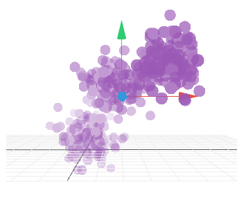

### Principal components analysis
 
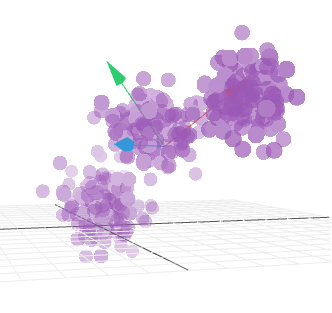

## Clustring

### Clustering

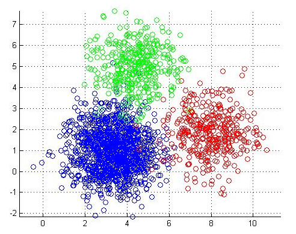

### k-means

Non-hierarchical clustering method

minimize within-cluster sum of squares

$$\underset{\mathbf{S}} {\operatorname{arg\,min}}  \sum_{i=1}^{k} \sum_{\mathbf x \in S_i} \left\| \mathbf x - \boldsymbol\mu_i \right\|^2 = \underset{\mathbf{S}} {\operatorname{arg\,min}}  \sum_{i=1}^{k} |S_i| \operatorname{Var} S_i $$

### Adjusted Rand Index

$$\frac{a+b}{a+b+c+d}$$

### Adjusted Rand Index

\begin{table}[h]
\centering
\begin{tabular}{l|llll|l}
Class \textbackslash Cluster & $v_1$    & $v_2$  & $\ldots$ & $v_C$  & Sums      \\ \hline
$u_1$                        & $n_{11}$ & $n_{12}$ & $\ldots$ & $n_{1C}$ & $n_{1.}$     \\
$u_2$                        & $n_{21}$ & $n_{22}$ & $\ldots$ & $n_{2C}$ & $n_{2.}$     \\
$\vdots$                     & $\vdots$ & $\vdots$ & $\ddots$ & $\vdots$ & $\vdots$     \\
$u_R$                        & $n_{R1}$ & $n_{R2}$ & $\ldots$ & $n_{RC}$ & $n_{R.}$     \\ \hline
Sums                         & $n_{.1}$ & $n_{.2}$ & $\ldots$ & $n_{.C}$ & $n_{..} = n$
\end{tabular}
\label{tab:1iY}
\end{table}

### Adjusted Rand Index

\begin{align}
\frac{ 
	\sum_{i,j} \binom{n_{ij}}{2}
	-
	\left[ \sum_i \binom{n_{i.}}{2} \sum_j \binom{n_{.j}}{2} \right] / \binom{n}{2}
 }{
	\frac{1}{2} 
	\left[ 
		\sum_i 
		\binom{n_{i.}}{2}
		+
		\sum_j
		\binom{n_{.j}}{2}
	\right]
	-
	\left[ \sum_i \binom{n_{i.}}{2} \sum_j \binom{n_{.j}}{2} \right] / \binom{n}{2}
}
\label{eq:1ix}
\end{align}


### $C_e$

$$ C_e = 100 (\mathrm{ARI}_d - \mathrm{ARI}_p  ) $$
$$ (d<p) $$

## Applications

### Distances

\begin{align}
a=u_1^T u_2 = \sum_{i=1}^{D} u_{1,i} u_{2,i} \\
d_{(\alpha)} = \sum_{i=1}^{D} \mathopen| u_1 - u_2 \mathclose|^\alpha 
\label{eq:1hP}
\end{align}

### Distances

$$ A^T A : O(n^2D)$$

$$ O(n^2 \hat{f}) $$

### Database Query Optimization

joins and execution plan

### Sub-linear Nearest Neighbor Searching

$$ O(nD) \rightarrow O(nk) $$
$$ (\alpha > 1) l_\alpha \rightarrow O(n^\gamma) (\gamma < 1) $$

# Stable Random Projection

## Stable Distribution

### Stable Distribution

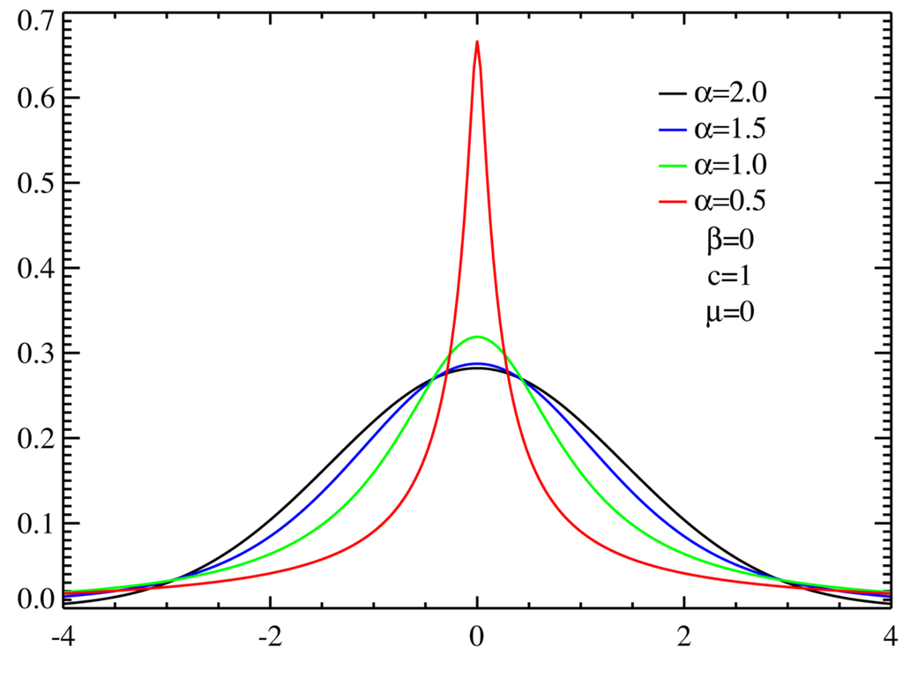

### Stable Distribution

$$ X_1 + X_2 + \cdots + X_n =^d c_n X + d_n $$
Gaussian/normal:
$$ f(x) = (2\pi)^{1/2} \exp (-x^2/2)$$
Cauchy:

$$ f(x) = 1/(\pi(1+x^2)) $$

### Stable Normal N(0,1)

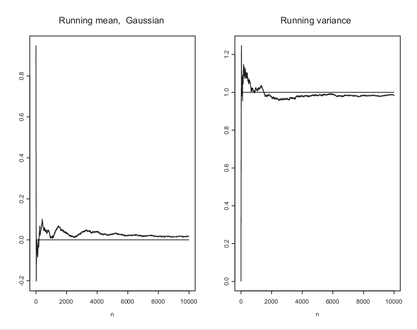

### Stable $\alpha = 1.5$

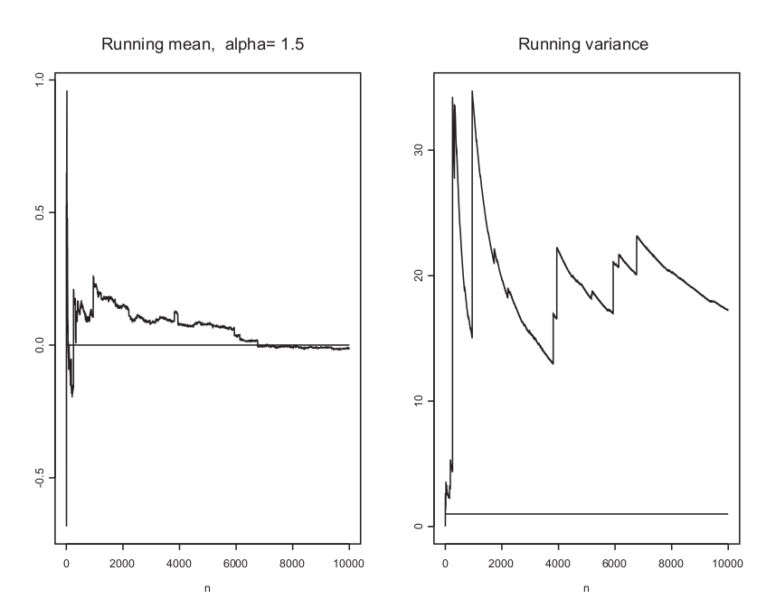

### Stable $\alpha = 0.75$

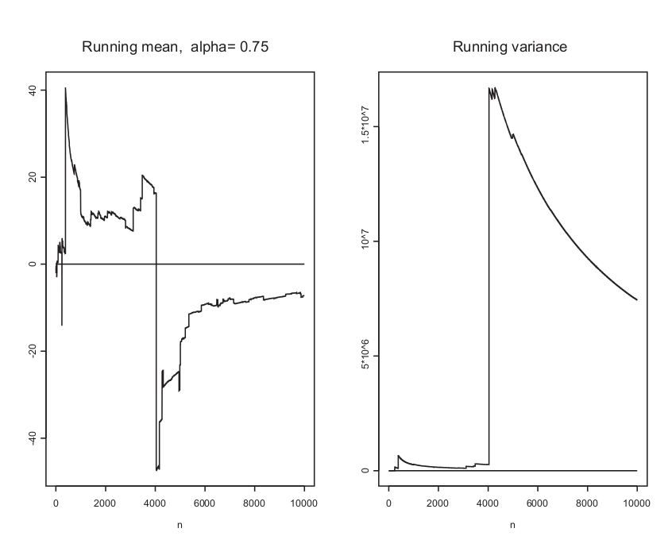

## Stable Random Projection

### Stable Random Projection

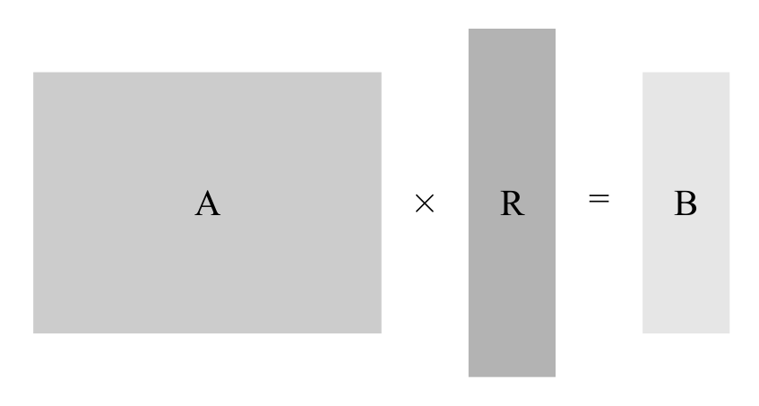

### Stable Random Projection

Johnson-Lindenstrauss Lemma:

$$ k = O \left ( \frac{\log n}{\epsilon^2 } \right ) $$
$$ l_2: 1 \pm \epsilon$$

### Statistical estimation problem

\begin{align}
v_{1,j} \sim S \bigg( \alpha, \sum_{i=1}^D |u_{1,i}|^\alpha \bigg), \;\;
v_{2,j} \sim S \bigg( \alpha, \sum_{i=1}^D |u_{2,i}|^\alpha \bigg),\\
x_j = v_{1,j} - v_{2,j} \sim S \bigg( \alpha, d_{(\alpha)} = 
\sum_{i=1}^D | u_{1,i} - u_{2,i} |^\alpha \bigg).
\end{align}

### Couchy Random Projection

$$d = \sum_{i=1}^D | u_{1,i} - u_{2,i} | $$

### Very Sparse Random Projection

$$\left\{ -1, 0, 1 \right\}$$

$$\left\{ \frac{1}{2s}, 1 - \frac{1}{s}, \frac{1}{2s} \right\}$$

$$ O(Dk) \rightarrow O(Dk/s) $$

### $l_\alpha$ Random Projection

$$d_{(\alpha)} = \sum_{i=1}^D \left| u_{1,i} - u_{2,i} \right|^{\alpha}$$

# Data & Implementation

### Data summary

```{r , include=FALSE}
rm(list = ls(all.names = TRUE))
library(kableExtra)
load('SimData_A1D2_1io.RData')
```

\begin{center}

```{r, echo=FALSE}
tabel1 <- data.frame(Dataset = character(length(d)), n = numeric(length(d)), D = numeric(length(d)), class = numeric(length(d)), stringsAsFactors = FALSE)
for(dIndex in 1:length(d)){
td <- d[[dIndex]]
tabel1[dIndex, ] <- data.frame(Dataset = td$name,
                                n  = nrow(td$data), 
                                D  = ncol(td$data),
                                class = length(unique(td$class)),
                              stringsAsFactors = FALSE)
}
kable(tabel1, format = "latex",row.names = FALSE, col.names = c("Dataset","$n$", "$D$", "$N_{class}$"), escape = FALSE) 
```

\end{center}

# Results

### $C_e$

$$ C_e = 100 (\mathrm{ARI}_d - \mathrm{ARI}_p  ) $$
$$ (d<p) $$


## Normal $\alpha = 2, d = 2$

### Tabel $\alpha = 2, d = 2$
```{r , include=FALSE}
rm(list = ls(all.names = TRUE))
library(kableExtra)
load('SimData_A2D2_1ig.RData')
```

\begin{center}

```{r , echo=FALSE}
tabel1 <- data.frame(Dataset = character(length(d)), ARI_d = numeric(length(d)), ARI_p = numeric(length(d)), C_e = numeric(length(d)), stringsAsFactors = FALSE)
for(dIndex in 1:7){
td <- d[[dIndex]]
tabel1[dIndex, ] <- data.frame(Dataset = td$name,
                                ARI_d  = round(mean(td$ARIreport[,1]),2), 
                                ARI_p  = round(mean(td$ARIreport[,2]),2), 
                                C_e    = -round(mean(td$ARIreport[,3])),
                              stringsAsFactors = FALSE)
}
kable(tabel1[c(1:5,7,6),], format = "latex",row.names = FALSE, col.names = c("Dataset","${ARI}_p$", "${ARI}_d$", "$C_e$"), escape = FALSE) 
```

\end{center}

### Histogram 2 peak

```{r, out.width='1\\linewidth', fig.align='center', echo=FALSE}
for(dIndex in 'thyroid'){
hist(d[[dIndex]]$ARIreport[,2], breaks = 50, main = bquote(paste(.(d[[dIndex]]$name),' ',ARI[d])), xlab = 'ARI')
}
```

### Hisogram undefined

```{r, out.width='1\\linewidth', fig.align='center', echo=FALSE}
for(dIndex in 'banknote'){
hist(d[[dIndex]]$ARIreport[,2], breaks = 50, main = bquote(paste(.(d[[dIndex]]$name),' ',ARI[d])), xlab = 'ARI')
}
```


### Hisogram efficient

```{r, out.width='1\\linewidth', fig.align='center', echo=FALSE}
for(dIndex in 'MPEwoNA'){
hist(d[[dIndex]]$ARIreport[,2], breaks = 50, main = bquote(paste(.(d[[dIndex]]$name),' ',ARI[d])), xlab = 'ARI')
}
```

## Normal $\alpha = 2, d = 3$

### Tabel $\alpha = 2, d = 3$
```{r , include=FALSE}
rm(list = ls(all.names = TRUE))
library(kableExtra)
load('SimData_A2D3_1im.RData')
```

\begin{center}

```{r, echo=FALSE}
tabel1 <- data.frame(Dataset = character(length(d)), ARI_d = numeric(length(d)), ARI_p = numeric(length(d)), C_e = numeric(length(d)), stringsAsFactors = FALSE)
for(dIndex in 1:length(d)){
td <- d[[dIndex]]
tabel1[dIndex, ] <- data.frame(Dataset = td$name,
                                ARI_d  = round(mean(td$ARIreport[,1]),2), 
                                ARI_p  = round(mean(td$ARIreport[,2]),2), 
                                C_e    = -round(mean(td$ARIreport[,3])),
                              stringsAsFactors = FALSE)
}
kable(tabel1, format = "latex",row.names = FALSE, col.names = c("Dataset","${ARI}_p$", "${ARI}_d$", "$C_e$"), escape = FALSE) 
```

\end{center}

## Cauchy $\alpha = 1, d = 2$

### Tabel $\alpha = 1, d = 2$

```{r , include=FALSE}
rm(list = ls(all.names = TRUE))
library(kableExtra)
load('SimData_A1D2_1io.RData')
```

\begin{center}

```{r, echo=FALSE}
tabel1 <- data.frame(Dataset = character(length(d)), ARI_d = numeric(length(d)), ARI_p = numeric(length(d)), C_e = numeric(length(d)), stringsAsFactors = FALSE)
for(dIndex in 1:length(d)){
td <- d[[dIndex]]
tabel1[dIndex, ] <- data.frame(Dataset = td$name,
                                ARI_d  = round(mean(td$ARIreport[,1]),2), 
                                ARI_p  = round(mean(td$ARIreport[,2]),2), 
                                C_e    = -round(mean(td$ARIreport[,3])),
                              stringsAsFactors = FALSE)
}
kable(tabel1, format = "latex",row.names = FALSE, col.names = c("Dataset","${ARI}_p$", "${ARI}_d$", "$C_e$"), escape = FALSE) 
```

\end{center}


## Cauchy $\alpha = 1, d = 3$

### Tabel $\alpha = 1, d = 3$

```{r , include=FALSE}
rm(list = ls(all.names = TRUE))
library(kableExtra)
load('SimData_A1D3_1in.RData')
```


\begin{center}

```{r, echo=FALSE}
tabel1 <- data.frame(Dataset = character(length(d)), ARI_d = numeric(length(d)), ARI_p = numeric(length(d)), C_e = numeric(length(d)), stringsAsFactors = FALSE)
for(dIndex in 1:length(d)){
td <- d[[dIndex]]
tabel1[dIndex, ] <- data.frame(Dataset = td$name,
                                ARI_d  = round(mean(td$ARIreport[,1]),2), 
                                ARI_p  = round(mean(td$ARIreport[,2]),2), 
                                C_e    = -round(mean(td$ARIreport[,3])),
                              stringsAsFactors = FALSE)
}
kable(tabel1, format = "latex",row.names = FALSE, col.names = c("Dataset","${ARI}_p$", "${ARI}_d$", "$C_e$"), escape = FALSE) 
```

\end{center}

## Sparse $s = 2, d = 2$

### Tabel $s = 2, d = 2$

```{r , include=FALSE}
rm(list = ls(all.names = TRUE))
library(kableExtra)
load('SimData_S2D2_1jK.RData')
```

\begin{center}

```{r, echo=FALSE}
tabel1 <- data.frame(Dataset = character(length(d)), ARI_d = numeric(length(d)), ARI_p = numeric(length(d)), C_e = numeric(length(d)), stringsAsFactors = FALSE)
for(dIndex in 1:length(d)){
td <- d[[dIndex]]
tabel1[dIndex, ] <- data.frame(Dataset = td$name,
                                ARI_d  = round(mean(td$ARIreport[,1]),2), 
                                ARI_p  = round(mean(td$ARIreport[,2]),2), 
                                C_e    = -round(mean(td$ARIreport[,3])),
                              stringsAsFactors = FALSE)
}
kable(tabel1, format = "latex",row.names = FALSE, col.names = c("Dataset","${ARI}_p$", "${ARI}_d$", "$C_e$"), escape = FALSE) 
```

\end{center}

## Sparse $s = 2, d = 3$

### Tabel $s = 2, d = 3$

```{r , include=FALSE}
rm(list = ls(all.names = TRUE))
library(kableExtra)
load('SimData_S2D3_1jR.RData')
```

\begin{center}

```{r, echo=FALSE}
tabel1 <- data.frame(Dataset = character(length(d)), ARI_d = numeric(length(d)), ARI_p = numeric(length(d)), C_e = numeric(length(d)), stringsAsFactors = FALSE)
for(dIndex in 1:length(d)){
td <- d[[dIndex]]
tabel1[dIndex, ] <- data.frame(Dataset = td$name,
                                ARI_d  = round(mean(td$ARIreport[,1]),2), 
                                ARI_p  = round(mean(td$ARIreport[,2]),2), 
                                C_e    = -round(mean(td$ARIreport[,3])),
                              stringsAsFactors = FALSE)
}
kable(tabel1, format = "latex",row.names = FALSE, col.names = c("Dataset","${ARI}_p$", "${ARI}_d$", "$C_e$"), escape = FALSE) 
```

\end{center}


## $C_e$ versus $\alpha$ for $d = 2$

```{r , include=FALSE}
rm(list = ls(all.names = TRUE))
library(kableExtra)
load('SimData_ARIvsAlphaD2_1jM.RData')
```

### Normal is better

```{r, out.width='1\\linewidth', fig.align='center', echo=FALSE}
for(dIndex in 'thyroid'){
plot(d[[dIndex]]$ARIvsAlpha[,1], -d[[dIndex]]$ARIvsAlpha[,6],
     type = 'o',
     main = bquote(.(d[[dIndex]]$name)~C[e]~' vs.'~alpha), xlab = bquote(alpha), ylab=bquote(C[e]))
}
```

### Cauchy is better

```{r, out.width='1\\linewidth', fig.align='center', echo=FALSE}
for(dIndex in 'iris'){
plot(d[[dIndex]]$ARIvsAlpha[,1], -d[[dIndex]]$ARIvsAlpha[,6],
     type = 'o',
     main = bquote(.(d[[dIndex]]$name)~C[e]~' vs.'~alpha), xlab = bquote(alpha), ylab=bquote(C[e]))
}
```


### $0<\alpha<1$ is better

```{r, out.width='1\\linewidth', fig.align='center', echo=FALSE}
for(dIndex in 'banknote'){
plot(d[[dIndex]]$ARIvsAlpha[,1], -d[[dIndex]]$ARIvsAlpha[,6],
     type = 'o',
     main = bquote(.(d[[dIndex]]$name)~C[e]~' vs.'~alpha), xlab = bquote(alpha), ylab=bquote(C[e]))
}
```

## $C_e$ versus $\alpha$ for $d = 3$

```{r , include=FALSE}
rm(list = ls(all.names = TRUE))
library(kableExtra)
load('SimData_ARIvsAlphaD3_1jP.RData')
```


### Normal is better

```{r, out.width='1\\linewidth', fig.align='center', echo=FALSE}
for(dIndex in 'seeds'){
plot(d[[dIndex]]$ARIvsAlpha[,1], -d[[dIndex]]$ARIvsAlpha[,6],
     type = 'o',
     main = bquote(.(d[[dIndex]]$name)~C[e]~' vs.'~alpha), xlab = bquote(alpha), ylab=bquote(C[e]))
}
```

### Cauchy is better

```{r, out.width='1\\linewidth', fig.align='center', echo=FALSE}
for(dIndex in 'banknote'){
plot(d[[dIndex]]$ARIvsAlpha[,1], -d[[dIndex]]$ARIvsAlpha[,6],
     type = 'o',
     main = bquote(.(d[[dIndex]]$name)~C[e]~' vs.'~alpha), xlab = bquote(alpha), ylab=bquote(C[e]))
}
```

### $0<\alpha<1$ is better

```{r, out.width='1\\linewidth', fig.align='center', echo=FALSE}
for(dIndex in 'iris'){
plot(d[[dIndex]]$ARIvsAlpha[,1], -d[[dIndex]]$ARIvsAlpha[,6],
     type = 'o',
     main = bquote(.(d[[dIndex]]$name)~C[e]~' vs.'~alpha), xlab = bquote(alpha), ylab=bquote(C[e]))
}
```

## $C_e$ versus $s$ in Sparse for $d = 2$

### MPE

```{r , include=FALSE}
rm(list = ls(all.names = TRUE))
library(kableExtra)
load('SimData_ARIvsSD2_1jN.RData')
```


```{r, out.width='1\\linewidth', fig.align='center', echo=FALSE}
for(dIndex in 'MPEwoNA'){
plot(d[[dIndex]]$ARIvsAlpha[,1], -d[[dIndex]]$ARIvsAlpha[,6],
     type = 'o',
     main = bquote(.(d[[dIndex]]$name)~C[e]~' vs.'~s), xlab = bquote(s), ylab=bquote(C[e]))
}
```

## $C_e$ versus $s$ in Sparse for $d = 3$

### Seeds
```{r , include=FALSE}
rm(list = ls(all.names = TRUE))
library(kableExtra)
load('SimData_ARIvsSD3_1jQ.RData')
```

```{r, out.width='1\\linewidth', fig.align='center', echo=FALSE}
for(dIndex in 'seeds'){
plot(d[[dIndex]]$ARIvsAlpha[,1], -d[[dIndex]]$ARIvsAlpha[,6],
     type = 'o',
     main = bquote(.(d[[dIndex]]$name)~C[e]~' vs.'~s), xlab = bquote(s), ylab=bquote(C[e]))
}
```

## Comparision $d = 2$
### Comparision $d = 2$

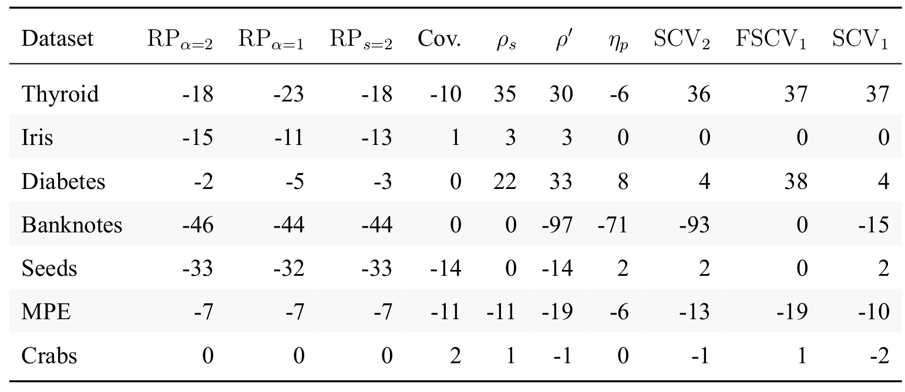

## Comparision $d = 3$
### Comparision $d = 3$

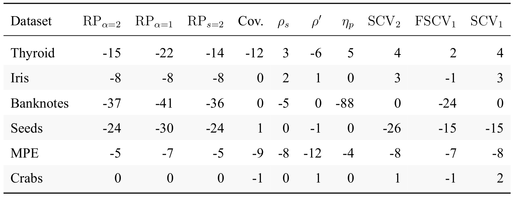

## ???

### Similarity measures

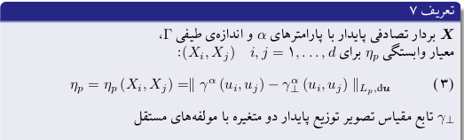

### Similarity measures

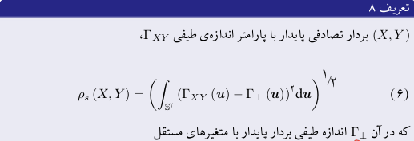

### Similarity measures


### Similarity measures

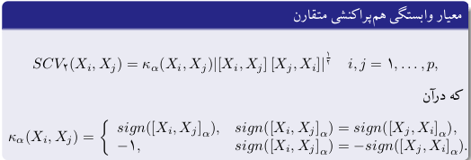

